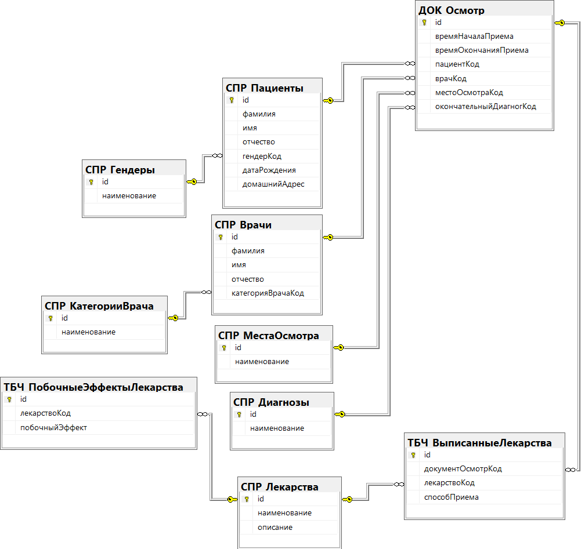

## Menu

- [Вернуться в главное меню](README.md#menu)
- [Логическая модель](#логическая-модель)
- [СПР_Гендеры](#спр_гендеры)
- [СПР_КатегорииВрача](#спр_категорииврача)
- [СПР_МестаОсмотра](#спр_местаосмотра)
- [СПР_Диагнозы](#спр_диагнозы)
- [СПР_Пациенты](#спр_пациенты)
- [СПР_Врачи](#спр_врачи)
- [СПР_Лекарства](#спр_лекарства)
- [ТБЧ_ПобочныеЭффектыЛекарства](#тбч_побочныеэффектылекарства)
- [ДОК_Осмотр](#док_осмотр)
- [ТБЧ_ВыписанныеЛекарства](#тбч_выписанныелекарства)

## Логическая модель

[Вернуться в меню](#menu)

## СПР_Гендеры

[Вернуться в меню](#menu)

| Ключ | Атрибут      | Тип         | Автоикремент | NOT NULL | DEFAULT | CHECK  |
| ---- | ------------ | ----------- | ------------ | -------- | ------- | ------ |
| PK   | id           | INT         | YES          | YES      |         | id > 0 |
|      | наименование | VARCHAR(64) |              | YES      |         |        |

## СПР_КатегорииВрача

[Вернуться в меню](#menu)

| Ключ | Атрибут      | Тип         | Автоикремент | NOT NULL | DEFAULT | CHECK  |
| ---- | ------------ | ----------- | ------------ | -------- | ------- | ------ |
| PK   | id           | INT         | YES          | YES      |         | id > 0 |
|      | наименование | VARCHAR(64) |              | YES      |         |        |

## СПР_МестаОсмотра

[Вернуться в меню](#menu)

| Ключ | Атрибут      | Тип         | Автоикремент | NOT NULL | DEFAULT | CHECK  |
| ---- | ------------ | ----------- | ------------ | -------- | ------- | ------ |
| PK   | id           | INT         | YES          | YES      |         | id > 0 |
|      | наименование | VARCHAR(64) |              | YES      |         |        |

## СПР_Диагнозы

[Вернуться в меню](#menu)

| Ключ | Атрибут      | Тип         | Автоикремент | NOT NULL | DEFAULT | CHECK  |
| ---- | ------------ | ----------- | ------------ | -------- | ------- | ------ |
| PK   | id           | INT         | YES          | YES      |         | id > 0 |
|      | наименование | VARCHAR(64) |              | YES      |         |        |

## СПР_Пациенты

[Вернуться в меню](#menu)

| Ключ | Атрибут       | Тип          | Автоикремент | NOT NULL | DEFAULT | CHECK         |
| ---- | ------------- | ------------ | ------------ | -------- | ------- | ------------- |
| PK   | id            | INT          | YES          | YES      |         | id > 0        |
|      | фамилия       | VARCHAR(32)  |              | YES      |         |               |
|      | имя           | VARCHAR(32)  |              | YES      |         |               |
|      | отчество      | VARCHAR(32)  |              |          | NULL    |               |
| FK   | гендерКод     | INT          |              | YES      |         | гендерКод > 0 |
|      | датаРождения  | DATE         |              | YES      |         |               |
|      | домашнийАдрес | VARCHAR(128) |              | YES      |         |               |

## СПР_Врачи

[Вернуться в меню](#menu)

| Ключ | Атрибут           | Тип         | Автоикремент | NOT NULL | DEFAULT | CHECK                 |
| ---- | ----------------- | ----------- | ------------ | -------- | ------- | --------------------- |
| PK   | id                | INT         | YES          | YES      |         | id > 0                |
|      | фамилия           | VARCHAR(32) |              | YES      |         |                       |
|      | имя               | VARCHAR(32) |              | YES      |         |                       |
|      | отчество          | VARCHAR(32) |              |          | NULL    |                       |
| FK   | категорияВрачаКод | INT         |              | YES      |         | категорияВрачаКод > 0 |

## СПР_Лекарства

[Вернуться в меню](#menu)

| Ключ | Атрибут      | Тип           | Автоикремент | NOT NULL | DEFAULT | CHECK |
| ---- | ------------ | ------------- | ------------ | -------- | ------- | ----- |
| PK   | id           | VARCHAR(36)   |              | YES      | NEWID() |       |
|      | наименование | VARCHAR(64)   |              | YES      |         |       |
|      | описание     | VARCHAR(1024) |              |          | NULL    |       |

## ТБЧ_ПобочныеЭффектыЛекарства

[Вернуться в меню](#menu)

| Ключ | Атрибут        | Тип         | Автоикремент | NOT NULL | DEFAULT | CHECK  |
| ---- | -------------- | ----------- | ------------ | -------- | ------- | ------ |
| PK   | id             | INT         | YES          | YES      |         | id > 0 |
| FK   | лекарствоКод   | VARCHAR(36) |              | YES      |         |        |
|      | побочныйЭффект | VARCHAR(64) |              | YES      |         |        |

## ДОК_Осмотр

[Вернуться в меню](#menu)

| Ключ | Атрибут                 | Тип         | Автоикремент | NOT NULL | DEFAULT   | CHECK                       |
| ---- | ----------------------- | ----------- | ------------ | -------- | --------- | --------------------------- |
| PK   | id                      | VARCHAR(36) |              | YES      | NEWID()   |                             |
|      | времяНачалаПриема       | DATETIME    |              | YES      | getdate() |                             |
|      | времяОкончанияПриема    | DATETIME    |              | YES      | getdate() |                             |
| FK   | пациентКод              | INT         |              | YES      |           | пациентКод > 0              |
| FK   | врачКод                 | INT         |              | YES      |           | врачКод > 0                 |
| FK   | местоОсмотраКод         | INT         |              | YES      |           | местоОсмотраКод > 0         |
| FK   | окончательныйДиагнозКод | INT         |              | YES      |           | окончательныйДиагнозКод > 0 |

## ТБЧ_ВыписанныеЛекарства

[Вернуться в меню](#menu)

| Ключ | Атрибут           | Тип          | Автоикремент | NOT NULL | DEFAULT | CHECK  |
| ---- | ----------------- | ------------ | ------------ | -------- | ------- | ------ |
| PK   | id                | INT          | YES          | YES      |         | id > 0 |
| FK   | документОсмотрКод | VARCHAR(36)  |              | YES      |         |        |
| FK   | лекарствоКод      | VARCHAR(36)  |              | YES      |         |        |
|      | способПриема      | VARCHAR(256) |              |          | NULL    |        |
