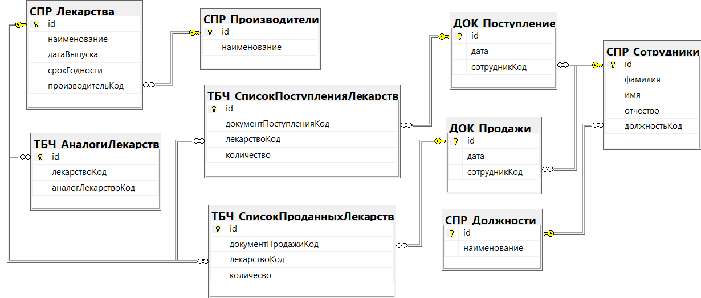

## Menu

- [Вернуться в главное меню](README.md#menu)
- [Логическая модель](#логическая-модель)
- [СПР_Лекарства](#спр_лекарства)
- [СПР_Производители](#спр_производители)
- [ТБЧ_АналогиЛекарств](#тбч_аналогилекарств)
- [ТБЧ_СписокПоступленияЛекарств](#тбч_списокпоступлениялекарств)
- [ТБЧ_СписокПродажиЛекарств](#тбч_списокпродажилекарств)
- [ДОК_Поступление](#док_поступление)
- [ДОК_Продажи](#док_продажи)
- [СПР_Сотрудники](#спр_сотрудники)
- [СПР_Должности](#спр_должности)

## Логическая модель

[Вернуться в меню](#menu)

## СПР_Лекарства

[Вернуться в меню](#menu)

| Ключ | Атрибут          | Тип         | Автоикремент | NOT NULL | DEFAULT | CHECK                |
| ---- | ---------------- | ----------- | ------------ | -------- | ------- | -------------------- |
| PK   | id               | VARCHAR(36) |              | YES      | NEWID() |                      |
|      | наименование     | VARCHAR(64) |              | YES      |         |                      |
|      | датаВыпуска      | DATE        |              | YES      |         |                      |
|      | срокГодности     | INT         |              | YES      |         | срокГодности > 0     |
| FK   | производительКод | INT         |              | YES      |         | производительКод > 0 |

## СПР_Производители

[Вернуться в меню](#menu)

| Ключ | Атрибут      | Тип         | Автоикремент | NOT NULL | DEFAULT | CHECK  |
| ---- | ------------ | ----------- | ------------ | -------- | ------- | ------ |
| PK   | id           | INT         | YES          | YES      |         | id > 0 |
|      | наименование | VARCHAR(64) |              | YES      |         |        |

## ТБЧ_АналогиЛекарств

[Вернуться в меню](#menu)

| Ключ | Атрибут            | Тип         | Автоикремент | NOT NULL | DEFAULT | CHECK  |
| ---- | ------------------ | ----------- | ------------ | -------- | ------- | ------ |
| PK   | id                 | INT         | YES          | YES      |         | id > 0 |
| FK   | лекарствоКод       | VARCHAR(36) |              | YES      |         |        |
| FK   | аналогЛекарстваКод | VARCHAR(36) |              | YES      |         |        |

## ТБЧ_СписокПоступленияЛекарств

[Вернуться в меню](#menu)

| Ключ | Атрибут                | Тип         | Автоикремент | NOT NULL | DEFAULT | CHECK          |
| ---- | ---------------------- | ----------- | ------------ | -------- | ------- | -------------- |
| PK   | id                     | INT         | YES          | YES      |         | id > 0         |
| FK   | документПоступленияКод | VARCHAR(36) |              | YES      |         |                |
| FK   | лекарстваКод           | VARCHAR(36) |              | YES      |         |                |
|      | количество             | INT         |              | YES      | 1       | количество > 0 |

## ТБЧ_СписокПродажиЛекарств

[Вернуться в меню](#menu)

| Ключ | Атрибут                | Тип         | Автоикремент | NOT NULL | DEFAULT | CHECK          |
| ---- | ---------------------- | ----------- | ------------ | -------- | ------- | -------------- |
| PK   | id                     | INT         | YES          | YES      |         | id > 0         |
| FK   | документПоступленияКод | VARCHAR(36) |              | YES      |         |                |
| FK   | лекарстваКод           | VARCHAR(36) |              | YES      |         |                |
|      | количество             | INT         |              | YES      | 1       | количество > 0 |

## ДОК_Поступление

[Вернуться в меню](#menu)

| Ключ | Атрибут      | Тип         | Автоикремент | NOT NULL | DEFAULT   | CHECK            |
| ---- | ------------ | ----------- | ------------ | -------- | --------- | ---------------- |
| PK   | id           | VARCHAR(36) |              | YES      | NEWID()   |                  |
|      | дата         | DATE        |              | YES      | getdate() |                  |
| FK   | сотрудникКод | INT         |              | YES      |           | сотрудникКод > 0 |

## ДОК_Продажи

[Вернуться в меню](#menu)

| Ключ | Атрибут      | Тип         | Автоикремент | NOT NULL | DEFAULT   | CHECK            |
| ---- | ------------ | ----------- | ------------ | -------- | --------- | ---------------- |
| PK   | id           | VARCHAR(36) |              | YES      | NEWID()   |                  |
|      | дата         | DATE        |              | YES      | getdate() |                  |
| FK   | сотрудникКод | INT         |              | YES      |           | сотрудникКод > 0 |

## СПР_Сотрудники

[Вернуться в меню](#menu)

| Ключ | Атрибут      | Тип         | Автоикремент | NOT NULL | DEFAULT | CHECK            |
| ---- | ------------ | ----------- | ------------ | -------- | ------- | ---------------- |
| PK   | id           | INT         | YES          | YES      |         | id > 0           |
|      | фамилия      | VARCHAR(32) |              | YES      |         |                  |
|      | имя          | VARCHAR(32) |              | YES      |         |                  |
|      | отчество     | VARCHAR(32) |              |          | NULL    |                  |
| FK   | должностьКод | INT         |              | YES      |         | должностьКод > 0 |

## СПР_Должности

[Вернуться в меню](#menu)

| Ключ | Атрибут      | Тип         | Автоикремент | NOT NULL | DEFAULT | CHECK  |
| ---- | ------------ | ----------- | ------------ | -------- | ------- | ------ |
| PK   | id           | INT         | YES          | YES      |         | id > 0 |
|      | наименование | VARCHAR(64) |              | YES      |         |        |
