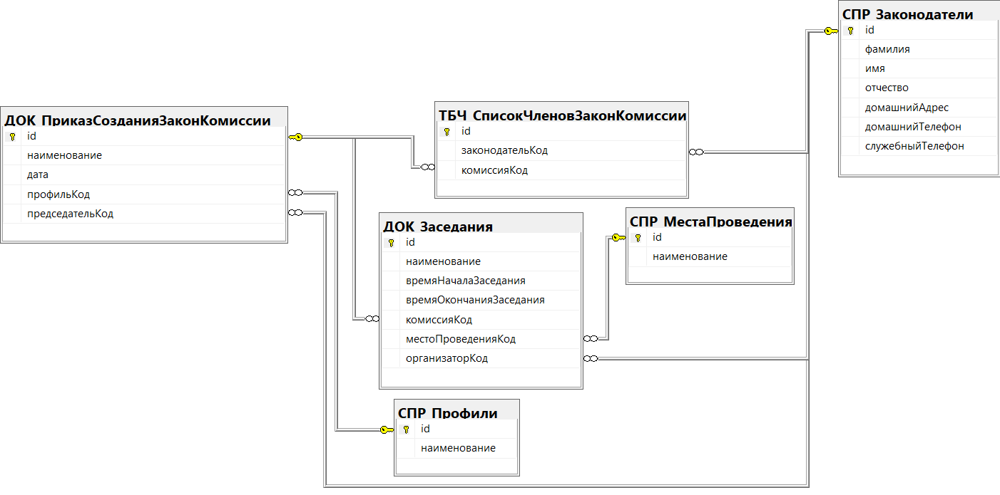

## Menu

- [Вернуться в главное меню](README.md#menu)
- [Логическая модель](#логическая-модель)
- [СПР_МестаПроведения](#спр_местапроведения)
- [СПР_МестаПрофили](#спр_профили)
- [СПР_Законодатели](#спр_законодатели)
- [ДОК_ПриказСозданияЗаконКомиссии](#док_приказсозданиязаконкомиссии)
- [ТБЧ_СписокЧленовЗаконКомиссии](#тбч_списокчленовзаконкомиссии)
- [ДОК_Заседание](#док_заседание)

## Логическая модель

[Вернуться в меню](#menu)

## СПР_МестаПроведения

[Вернуться в меню](#menu)

| Ключ | Атрибут      | Тип         | Автоикремент | NOT NULL | DEFAULT | CHECK  |
| ---- | ------------ | ----------- | ------------ | -------- | ------- | ------ |
| PK   | id           | INT         | YES          | YES      |         | id > 0 |
|      | наименование | VARCHAR(64) |              | YES      |         |        |

## СПР_Профили

[Вернуться в меню](#menu)

| Ключ | Атрибут      | Тип         | Автоикремент | NOT NULL | DEFAULT | CHECK  |
| ---- | ------------ | ----------- | ------------ | -------- | ------- | ------ |
| PK   | id           | INT         | YES          | YES      |         | id > 0 |
|      | наименование | VARCHAR(64) |              | YES      |         |        |

## СПР_Законодатели

[Вернуться в меню](#menu)

| Ключ | Атрибут          | Тип         | Автоикремент | NOT NULL | DEFAULT | CHECK  |
| ---- | ---------------- | ----------- | ------------ | -------- | ------- | ------ |
| PK   | id               | INT         | YES          | YES      |         | id > 0 |
|      | фамилия          | VARCHAR(32) |              | YES      |         |        |
|      | имя              | VARCHAR(32) |              | YES      |         |        |
|      | отчество         | VARCHAR(32) |              |          | NULL    |        |
|      | домашнийАдрес    | VARCHAR(64) |              |          | NULL    |        |
|      | домашнийТелефон  | VARCHAR(64) |              |          | NULL    |        |
|      | служебныйТелефон | VARCHAR(64) |              |          | NULL    |        |

## ДОК_ПриказСозданияЗаконКомиссии

[Вернуться в меню](#menu)

| Ключ | Атрибут         | Тип         | Автоикремент | NOT NULL | DEFAULT   | CHECK               |
| ---- | --------------- | ----------- | ------------ | -------- | --------- | ------------------- |
| PK   | id              | VARCHAR(36) |              | YES      | NEWID()   |                     |
|      | наименование    | VARCHAR(64) |              | YES      |           |                     |
|      | дата            | DATETIME    |              | YES      | getdate() |                     |
| FK   | профильКод      | INT         |              | YES      |           | профильКод > 0      |
| FK   | председательКод | INT         |              | YES      |           | председательКод > 0 |

## ТБЧ_СписокЧленовЗаконКомиссии

[Вернуться в меню](#menu)

| Ключ | Атрибут         | Тип         | Автоикремент | NOT NULL | DEFAULT | CHECK               |
| ---- | --------------- | ----------- | ------------ | -------- | ------- | ------------------- |
| PK   | id              | INT         | YES          | YES      |         | id > 0              |
| FK   | законодательКод | INT         |              | YES      |         | законодательКод > 0 |
| FK   | комиссияКод     | VARCHAR(36) |              | YES      |         |                     |

## ДОК_Заседание

[Вернуться в меню](#menu)

| Ключ | Атрибут                 | Тип         | Автоикремент | NOT NULL | DEFAULT   | CHECK                                          |
| ---- | ----------------------- | ----------- | ------------ | -------- | --------- | ---------------------------------------------- |
| PK   | id                      | VARCHAR(36) |              | YES      | NEWID()   |                                                |
|      | наименование            | VARCHAR(64) |              | YES      |           |                                                |
|      | времяНачалаЗаседания    | DATETIME    |              | YES      | getdate() | времяНачалаЗаседания < времяОкончанияЗаседания |
|      | времяОкончанияЗаседания | DATETIME    |              | YES      | getdate() | времяОкончанияЗаседания > времяНачалаЗаседания |
| FK   | комиссияКод             | VARCHAR(36) |              | YES      |           |                                                |
| FK   | местоПроведенияКод      | INT         |              | YES      |           | местоПроведенияКод > 0                         |
| FK   | организаторКод          | INT         |              | YES      |           | организаторКод > 0                             |
