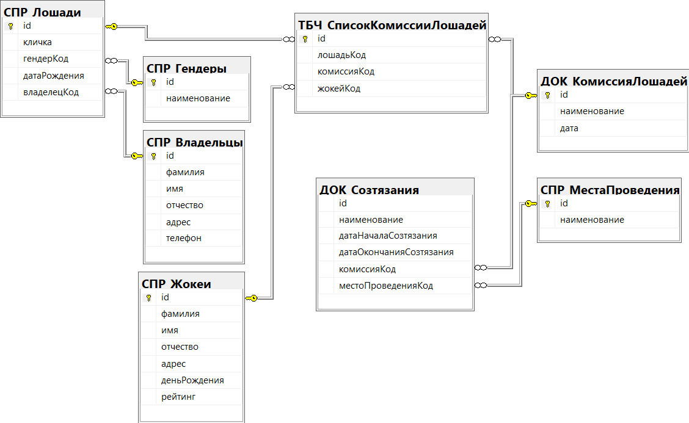

## Menu

- [Вернуться в главное меню](README.md#menu)
- [Логическая модель](#логическая-модель)
- [СПР_Гендеры](#спр_гендеры)
- [СПР_МестаПроведения](#спр_местапроведения)
- [СПР_Владельцы](#спр_владельцы)
- [СПР_Лошади](#спр_лошади)
- [СПР_Жокеи](#спр_жокеи)
- [ДОК_КомиссияЛошадей](#док_комиссиялошадей)
- [ТБЧ_СписокКомиссияЛошадей](#тбч_списоккомиссиялошадей)
- [ДОК_Созтязания](#док_созтязания)

## Логическая модель

[Вернуться в меню](#menu)

## СПР_Гендеры

[Вернуться в меню](#menu)

| Ключ | Атрибут      | Тип         | Автоикремент | NOT NULL | DEFAULT | CHECK  |
| ---- | ------------ | ----------- | ------------ | -------- | ------- | ------ |
| PK   | id           | INT         | YES          | YES      |         | id > 0 |
|      | наименование | VARCHAR(64) |              | YES      |         |        |

## СПР_МестаПроведения

[Вернуться в меню](#menu)

| Ключ | Атрибут      | Тип         | Автоикремент | NOT NULL | DEFAULT | CHECK  |
| ---- | ------------ | ----------- | ------------ | -------- | ------- | ------ |
| PK   | id           | INT         | YES          | YES      |         | id > 0 |
|      | наименование | VARCHAR(64) |              | YES      |         |        |

## СПР_Владельцы

[Вернуться в меню](#menu)

| Ключ | Атрибут  | Тип         | Автоикремент | NOT NULL | DEFAULT | CHECK  |
| ---- | -------- | ----------- | ------------ | -------- | ------- | ------ |
| PK   | id       | INT         | YES          | YES      |         | id > 0 |
|      | фамилия  | VARCHAR(32) |              | YES      |         |        |
|      | имя      | VARCHAR(32) |              | YES      |         |        |
|      | отчество | VARCHAR(32) |              |          | NULL    |        |
|      | адрес    | VARCHAR(64) |              |          | NULL    |        |
|      | телефон  | VARCHAR(64) |              |          | NULL    |        |

## СПР_Лошади

[Вернуться в меню](#menu)

| Ключ | Атрибут      | Тип         | Автоикремент | NOT NULL | DEFAULT | CHECK           |
| ---- | ------------ | ----------- | ------------ | -------- | ------- | --------------- |
| PK   | id           | INT         | YES          | YES      |         | id > 0          |
|      | кличка       | VARCHAR(32) |              | YES      |         |                 |
| FK   | гендерКод    | INT         |              | YES      |         | гендерКод > 0   |
|      | датаРождения | DATE        |              |          | NULL    |                 |
| FK   | владелецКод  | INT         |              | YES      |         | владелецКод > 0 |

## СПР_Жокеи

[Вернуться в меню](#menu)

| Ключ | Атрибут      | Тип         | Автоикремент | NOT NULL | DEFAULT | CHECK                      |
| ---- | ------------ | ----------- | ------------ | -------- | ------- | -------------------------- |
| PK   | id           | INT         | YES          | YES      |         | id > 0                     |
|      | фамилия      | VARCHAR(32) |              | YES      |         |                            |
|      | имя          | VARCHAR(32) |              | YES      |         |                            |
|      | отчество     | VARCHAR(32) |              |          | NULL    |                            |
|      | адрес        | VARCHAR(64) |              |          | NULL    |                            |
|      | деньРождения | DATE        |              |          | NULL    |                            |
|      | рейтинг      | FLOAT       |              |          | 0       | рейтинг >= 0, рейтинг <= 5 |

## ДОК_КомиссияЛошадей

[Вернуться в меню](#menu)

| Ключ | Атрибут      | Тип         | Автоикремент | NOT NULL | DEFAULT   | CHECK |
| ---- | ------------ | ----------- | ------------ | -------- | --------- | ----- |
| PK   | id           | VARCHAR(36) |              | YES      | NEWID()   |       |
|      | наименование | VARCHAR(64) |              | YES      |           |       |
|      | дата         | DATETIME    |              | YES      | getdate() |       |

## ТБЧ_СписокКомиссияЛошадей

[Вернуться в меню](#menu)

| Ключ | Атрибут     | Тип         | Автоикремент | NOT NULL | DEFAULT | CHECK         |
| ---- | ----------- | ----------- | ------------ | -------- | ------- | ------------- |
| PK   | id          | INT         | YES          | YES      |         | id > 0        |
| FK   | лошадьКод   | INT         |              | YES      |         | лошадьКод > 0 |
| FK   | комиссияКод | VARCHAR(36) |              | YES      |         |               |
| FK   | жокейКод    | INT         |              | YES      |         | жокейКод > 0  |

## ДОК_Созтязания

[Вернуться в меню](#menu)

| Ключ | Атрибут                 | Тип         | Автоикремент | NOT NULL | DEFAULT   | CHECK                  |
| ---- | ----------------------- | ----------- | ------------ | -------- | --------- | ---------------------- |
| PK   | id                      | INT         | YES          | YES      |           | id > 0                 |
|      | наименование            | VARCHAR(64) |              | YES      |           |                        |
|      | датаНачалаСозтязания    | DATETIME    |              | YES      | getdate() |                        |
|      | датаОкончанияСозтязания | DATETIME    |              | YES      | getdate() |                        |
| FK   | комиссияКод             | VARCHAR(36) |              | YES      |           |                        |
| FK   | местоПроведенияКод      | INT         |              | YES      |           | местоПроведенияКод > 0 |
